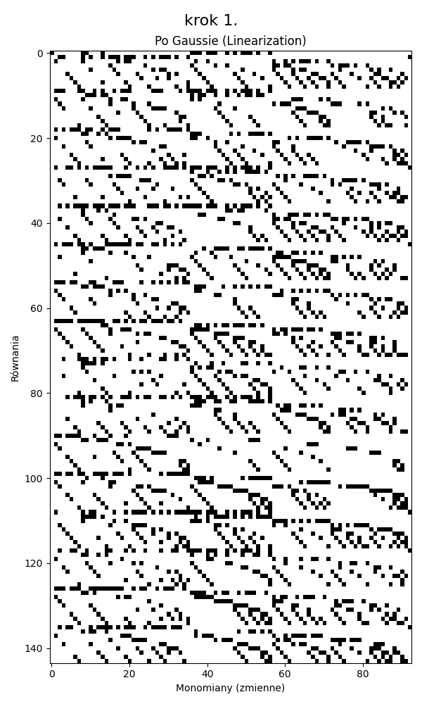

# MQ-XL Demo

Projekt edukacyjny demonstrujący działanie systemów kryptograficznych opartych na problemie Multivariate Quadratic (MQ) oraz skuteczność ataku XL (eXtended Linearization).

## O projekcie

Kryptografia wielomianowa (MQ) jest jednym z głównych kandydatów w dziedzinie kryptografii post-kwantowej. Jej bezpieczeństwo opiera się na trudności rozwiązywania układów równań kwadratowych nad ciałami skończonymi. Ten skrypt pokazuje, jak przy niewystarczających parametrach (zbyt duża liczba równań w stosunku do zmiennych), atak XL może sprowadzić problem nieliniowy do prostego układu równań liniowych.

## Główne funkcjonalności:

* MQSystem: Klasa implementująca szyfrowanie tekstowe (blokowe N=8 bitów) przy użyciu losowych wielomianów kwadratowych nad $GF(2)$.

* XLAttacker: Implementacja ataku XL obejmująca etapy Expansion (mnożenie równań przez monomiany) oraz Linearization (eliminacja Gaussa).

* Wizualizacja: Generowanie map bitowych macierzy XL przed i po ataku oraz wykresu przejścia fazowego skuteczności ataku.

## Wymagania

Do uruchomienia projektu wymagany jest Python 3.x oraz biblioteki wymienione w pliku requirements.txt.

## Uruchomienie

1. Zainstaluj biblioteki:
`pip install -r requirements.txt`

2. Uruchom główny skrypt:
`python main.py`

*Projekt przygotowany na potrzeby zajęć z kryptografii.*